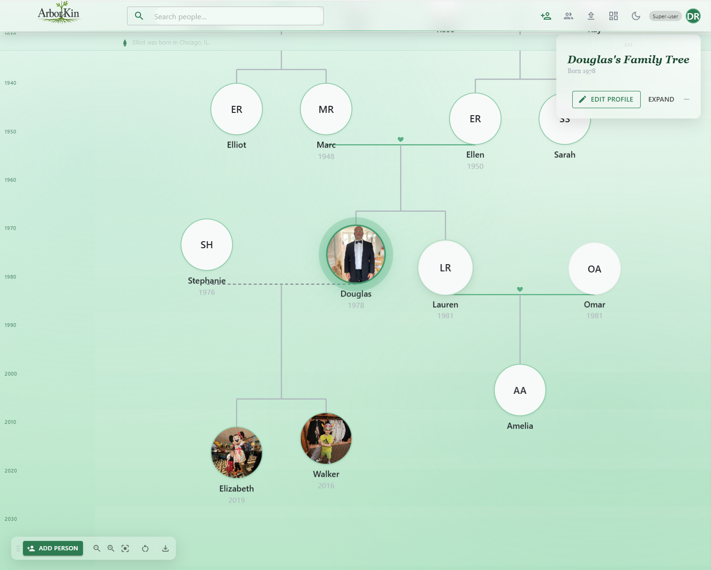
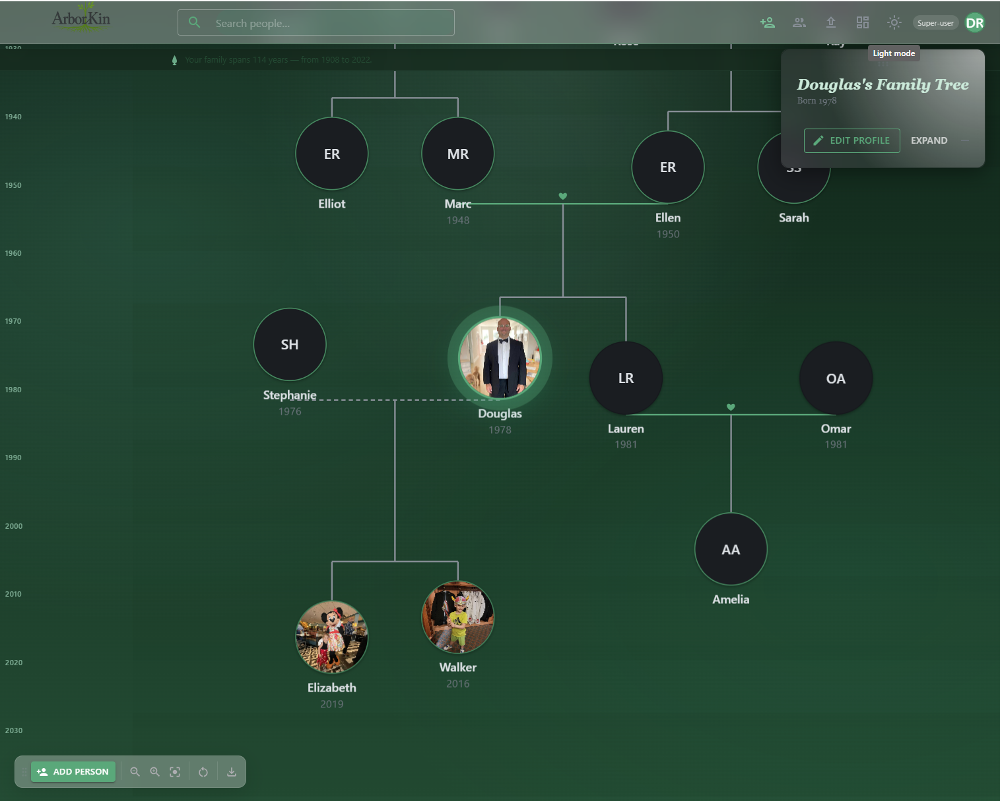
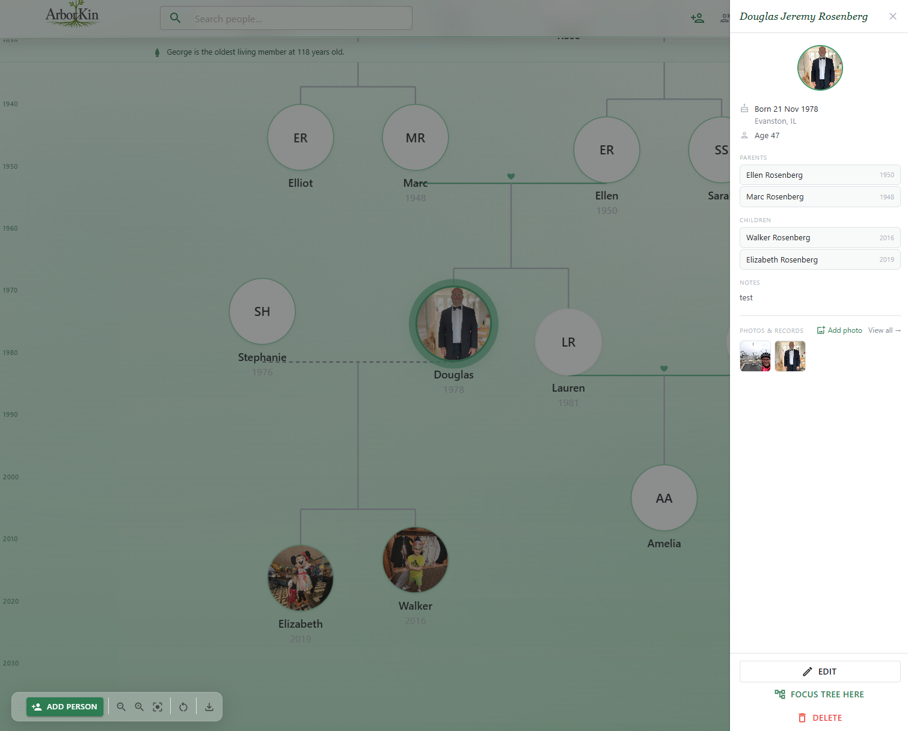
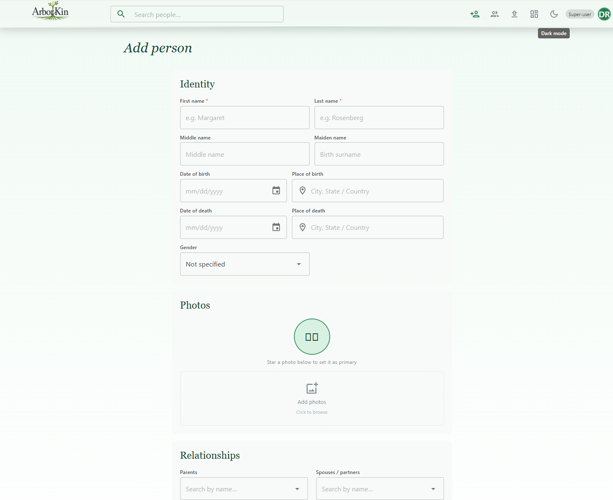
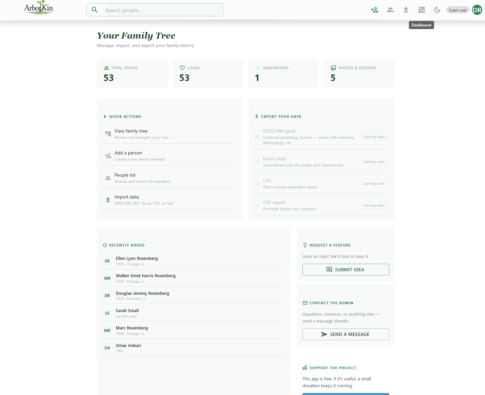
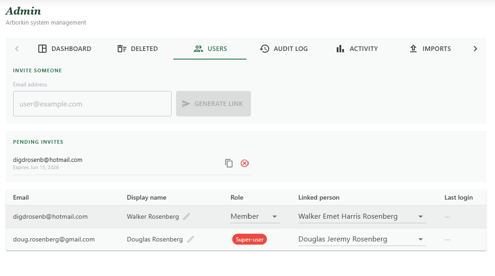

# ArborKin — Family Tree Application

[](https://github.com/shalant/FamilyTree/actions/workflows/ci.yml)
[](https://dotnet.microsoft.com/en-us/download/dotnet/10.0)
[](LICENSE)

## About ArborKin

**ArborKin** is a full-stack family tree application designed to help extended families reconnect and preserve their stories. Built with **Blazor Server**, **C# 13**, **EF Core**, and **SQL Server**, it provides an interactive canvas for visualizing genealogy, sharing family memories, and maintaining a permanent record of relationships across generations.

The application prioritizes **privacy first** — families control their own data, invited members can contribute stories and photos, and an audit log ensures complete accountability. The architecture emphasizes **reliability through constraints**: comprehensive tests, strict type safety, and database integrity validation catch bugs before production deployment.

Key technical highlights:
- **Custom C# layout engine** computing all node positions server-side without DOM measurement
- **Birth-year timeline Y-axis** for genealogical accuracy and visual continuity
- **Multi-tenant isolation** — each family's data is completely separated; role-based authorization controls edit privileges
- **Soft-delete recovery** — accidentally deleted family members can be restored; cascading soft-deletes preserve referential integrity
- **Invite-first auth** — registration requires a valid family invite token; families control membership
- **Azure deployment-ready** — App Service + SQL Database + Blob Storage; manual deploy gate prevents accidents

Designed as both a genuine family tool (actively used by 5+ family members) and a portfolio piece demonstrating professional full-stack .NET development.

---

## Test Status

| Metric | Status |
|--------|--------|
| **Core Tests** | 75/75 ✅ |
| **Web Tests** | 49/53 ✅ (4 skipped) |
| **Total** | 124 passing |
| **Build (Debug + Release)** | ✅ |
| **CI Pipeline** | ✅ [View Latest Run](https://github.com/shalant/FamilyTree/actions/workflows/ci.yml) |
| **Branch Protection** | ✅ Master requires PR + passing CI |

---

## Motivation

This project serves three intertwined goals: **practical**, **educational**, and **professional**.

**Practically**, it's a real tool for a real family. Building software for people you know (rather than hypothetical users) forces you to prioritize genuine usability and reliability. Every feature shipped must work correctly the first time — there's no room for tutorial-code shortcuts.

**Educationally**, it's a deliberate deep-dive into full-stack .NET development. Specifically: relational database design (schema evolution, migration sequencing, scoping strategies, cascade behavior), exploratory testing discipline (understanding when automated tests suffice and when manual testing catches things machines miss), and the architectural decisions that keep code maintainable as complexity grows.

**Professionally**, it's an end-to-end portfolio piece: not a tutorial clone or toy project, but a production-ready application with comprehensive tests, security constraints, role-based access control, and actual deployment infrastructure. It demonstrates the ability to ship a complete system, not just write code that passes a code review.

---

## Screenshots

<div style="display: grid; grid-template-columns: 1fr 1fr; gap: 2rem; margin: 2rem 0;">

<div>

### Tree Canvas (Light)



Interactive pan/zoom canvas with SVG connectors and draggable focus overlay.

</div>

<div>

### Tree Canvas (Dark)



Dark mode with glass-morphism surfaces and token-driven theme.

</div>

<div>

### Person Detail Drawer



Edit / delete actions while tree remains interactive behind the drawer.

</div>

<div>

### Add/Edit Form



Shared form for create/update with date validation and photo uploads.

</div>

<div>

### Dashboard



Stats, quick actions, activity feed, export options.

</div>

<div>

### Admin Panel



Invite management, user roles, linked-person assignment, audit log.

</div>

</div>

---

## What's Shipped

- **Custom layout engine** — All tree node positions computed in C# before rendering; Y-axis is a real genealogical timeline
- **Interactive canvas** — Pan, zoom, focus individual persons; draggable toolbar and info overlays persist to browser storage  
- **Role-based access control** — Invite-only registration, Admin vs. Member distinction, Google OAuth optional
- **Semantic duplicate detection** — Fuzzy name matching (Levenshtein distance, 80% threshold) catches typos and variations when linking new people
- **Family data isolation** — Each family's data completely separated; admins control who can edit/delete; multi-tenant scoping enforced at service layer
- **Story curation** — Family members can submit memories; admins moderate before public visibility
- **Media uploads** — Photos stored in Azure Blob Storage; web-optimized thumbnails
- **Audit trail** — Every create/update/delete logged with timestamp, user, and change summary
- **Admin dashboard** — Stats, activity feeds, user management, soft-deleted person recovery
- **CI/CD pipeline** — Automated tests on every push; branch protection requires PR + CI pass; manual deploy gate to production
- **Comprehensive tests** — 124 passing tests (75 Core + 49 Web) covering services, layout engine, auth, duplicate detection, and data integrity
- **Technical blog** — Deep-dive articles on RBAC, fuzzy matching, multi-tenant architecture, layout engine, and testing discipline in `docs/blogs/`

---

## Learn More

**Technical Blog** — Deep-dive articles on architectural decisions and lessons learned:
- [Role-Based Access Control Implementation](docs/blogs/01-rbac-implementation.md)
- [Fuzzy Name Matching with Levenshtein Distance](docs/blogs/02-fuzzy-name-matching.md)
- [Multi-Tenant Architecture for Family Trees](docs/blogs/03-multi-tenant-architecture.md)
- [Tree Layout Engine: Computing Positions in C#](docs/blogs/04-tree-layout-engine.md)
- [Testing Discipline: Constraints Over Code Review](docs/blogs/05-testing-discipline.md)

---

## Features

**Canvas & Tree**
- Pan + zoom with physics-based clamping; position state lives in JS, layout computed in C#
- Custom `FamilyTreeLayoutEngine` — all node (X, Y) positions calculated server-side before render; no DOM measurement
- Y-axis is a real birth-year timeline; SVG connectors for parents, spouses, children
- Former spouses rendered with dashed connectors; cross-root couple layout without connector tangles
- Focus mode persisted to `localStorage`; SSR flash prevention via `_ready` flag

**Auth & Security**
- ASP.NET Core Identity with cookie auth and optional Google OAuth
- Registration modes: `Open`, `InviteOnly` (production default), `Closed`
- Token-based invite flow with configurable TTL; admin-generated invite URLs
- Login rate limiting (5 req / 15 min per IP) + Identity account lockout
- `ICurrentUserService` interface in Core, implemented in Web — no `HttpContext` in the service layer
- Super-user bootstrap on startup via config (idempotent)

**Multi-tenant Family Isolation**
- `FamilyId` claim baked into auth cookie at sign-in
- All person queries scoped to the caller's family; super-users bypass scoping to see all data
- Audit fields (`CreatedBy`, `UpdatedBy`, `DeletedBy`, `FamilyId`) stamped on every write

**Admin Panel**
- Dashboard stats, daily activity chart, deleted-persons restore, user management
- Audit log with entity type / action / timestamp; activity counts tracked per user per day

**Data**
- Soft delete on `Person`, `Relationship`, `Medium` — global EF query filters
- `Relationship` canonical ordering: lower `Guid` is always `PersonAId`; unique DB constraint prevents duplicates
- `Relationship.EndDate` distinguishes active from former spouses
- Filtered performance indexes on `People`, `Relationships`, `AuditLogs`
- EF migrations run automatically on startup via `MigrateAsync()`

**Media & Export**
- Azure Blob Storage for photo uploads; falls back to Azurite for local dev
- SVG tree export (full canvas), CSV and JSON person export

**CI/CD**
- GitHub Actions CI: build + test on every push to `master`
- Manual deploy to Azure App Service (B1 Linux) via `workflow_dispatch`

---

## Architecture

Single-service design — no HTTP boundary between UI and data layer:

```
FamilyTree.Web   (Blazor Server + MudBlazor — Azure App Service B1)
     ↓  direct service injection
FamilyTree.Core  (Service layer + EF Core)
     ↓
SQL Server (local SQLEXPRESS) / Azure SQL Database (prod)
```

**Projects:**
- `FamilyTree.Shared` — DTOs and enums; no logic; shared by Core and Web
- `FamilyTree.Core` — Services, EF Core, blob storage, migrations
- `FamilyTree.Web` — Blazor Server UI; injects `IPersonService` etc. directly

Key design decisions are documented in `docs/` (ADR 001: JS-free layout engine, relationship canonical ordering, cross-root couple layout, SSR flash prevention).

---

## Quality Strategy

Confidence in code comes from rigorous constraints, not subjective review. This project follows **Uncle Bob Martin's approach**: surround agents (and developers) with a gauntlet of automated checks that catch bugs early.

**Constraints in place:**
- **Comprehensive test suites** — 75 Core + 41 Web tests; new features come with regression test pairs (before/after)
- **Strict type safety** — C# 13 nullable reference types; compiler catches entire categories of null-reference bugs
- **CI enforcement** — `dotnet build` + `dotnet test` must pass on every push (no manual override path)
- **Database integrity** — unique constraints, referential integrity, soft-delete cascade tracking; data shape enforced by the schema
- **Build verification** — Release builds verified locally before pushing; Warnings treated as errors

**Result:** The test suite is comprehensive enough that human code review is optional — if code passes the gauntlet, it works.

---

## Testing

| Test Type | Framework | Runs | Command |
|-----------|-----------|-------|---------|
| **Unit Tests** (Core services) | xUnit + FluentAssertions | ✅ CI on every PR | `dotnet test` |
| **Component Tests** (Blazor) | bUnit | ✅ CI on every PR | `dotnet test` |
| **UI Tests** (E2E) | Playwright | 🖥️ Local only | `dotnet run` + `dotnet test` |

**Unit & Component Tests** — Automated in CI
- Run on every PR and push to any branch
- In-memory EF Core provider; each test gets isolated database
- ~2–3 min total

**UI Tests** — Manual local testing
- Require running app server + browser
- Run locally before pushing: `dotnet watch` + `dotnet test --filter "UiTests"`

### Core Test Coverage

**`PersonServiceTests` (8 tests)**
- Create returns person with correct name
- `CreatedBy` and `FamilyId` are stamped on every create
- Whitespace-only first name is rejected
- Birth date after death date returns a failure message
- Soft delete sets `DeletedAt` + `DeletedBy`; record invisible to normal queries
- Restore clears those fields; record becomes visible again
- Family scoping: user with `FamilyId = X` only sees family X
- Super-user with no `FamilyId` sees all persons across families

**`RelationshipServiceTests` (3 tests)**
- Canonical ordering: lower GUID always stored as `PersonA`
- Duplicate relationship creation returns failure (not DB exception)
- Delete hard-removes relationship record

**`ComponentTests` (4 tests, 4 skipped)**
- FamilyTreeCanvas renders without errors
- HeroOverlay displays when visible
- ToastService shows notifications
- PersonDetailDrawer (skipped — complex MudBlazor dependencies)

**`StoryTests` (3 tests)**
- Story submission validation
- Invite token expiry checks
- Auth focus state persistence

### Run Tests Locally

```bash
# Unit + component tests (same as CI)
dotnet test FamilyTree.sln

# UI tests (requires running server)
dotnet watch  # Terminal 1
dotnet test --filter "UiTests"  # Terminal 2
```

---

## Project Structure

```
FamilyTree/
├── src/
│   ├── FamilyTree.Shared/        # DTOs, enums (no logic)
│   ├── FamilyTree.Core/          # Services, EF Core, migrations, blob storage
│   └── FamilyTree.Web/           # Blazor Server UI, auth endpoints
│       ├── Components/           # Canvas, PersonNode, drawers, dialogs, admin
│       ├── Services/             # CurrentUserService, ThemeService, etc.
│       └── wwwroot/              # CSS, JS (canvas-interaction.js only)
├── tests/
│   ├── FamilyTree.Core.Tests/    # Service-layer tests (xUnit + InMemory EF)
│   └── FamilyTree.Web.Tests/     # Component tests (bUnit)
├── docs/                         # ADRs, build plan, deployment, next steps
└── .github/workflows/            # ci.yml (test on push), deploy-web.yml (manual)
```
