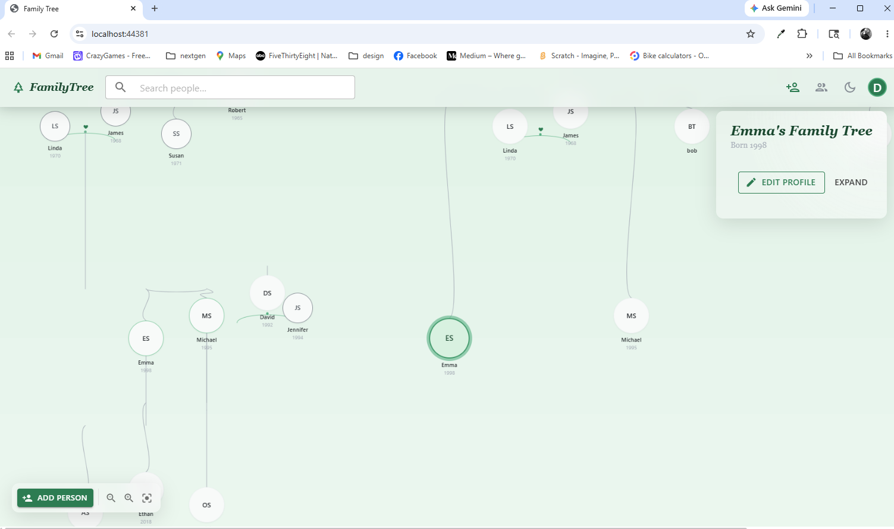
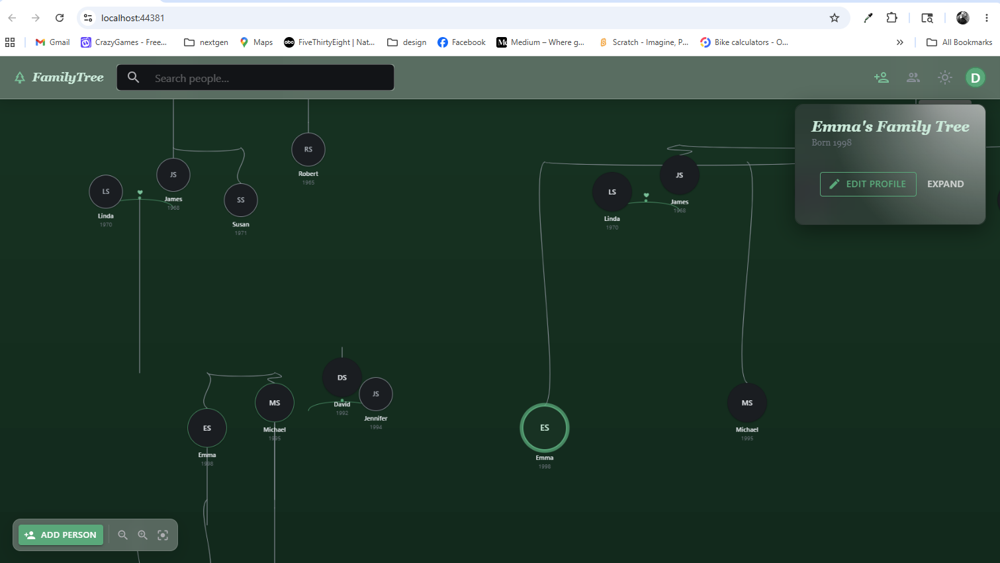
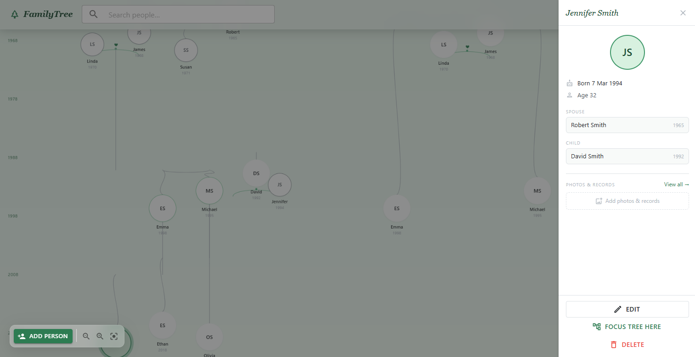
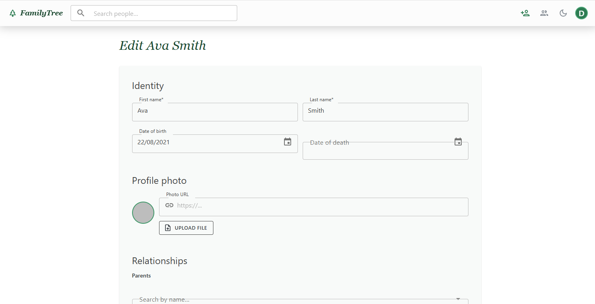
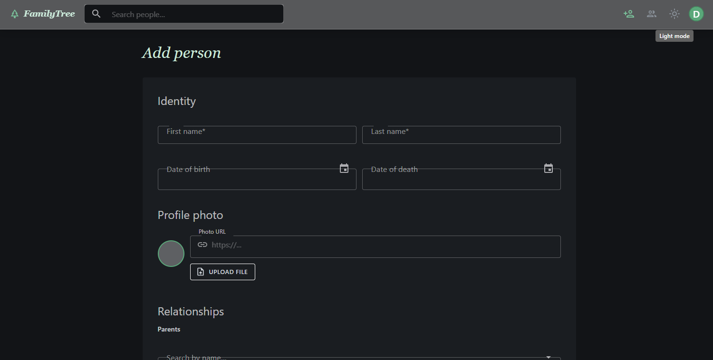
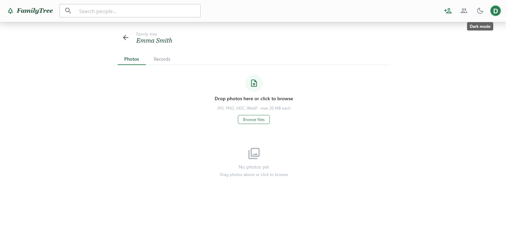
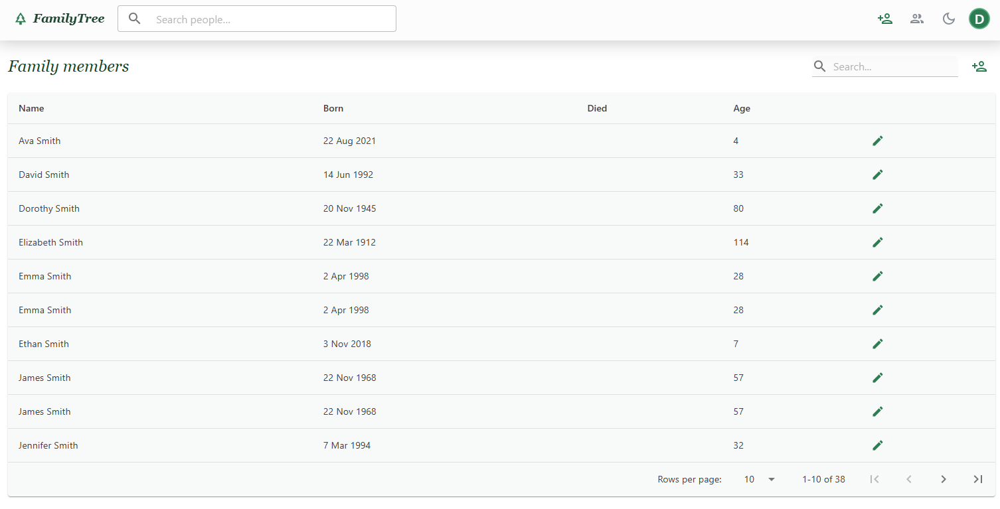

# FamilyTree

[](https://github.com/shalant/FamilyTree/actions/workflows/ci.yml)

A full-stack family tree application built with **Blazor Server (.NET 10)**, **EF Core**, **SQL Server**, and **MudBlazor** — featuring a custom C# layout engine, smooth pan/zoom canvas, multi-tenant family isolation, invite-only auth, and an admin panel with audit logging.

---

## Screenshots

### 1. Full Family Tree Canvas



Interactive canvas with SVG connectors, focus node highlight, and draggable hero overlay — light mode.

---

### 2. Dark Mode Tree



Dark mode variant showing the token-driven theme system and glass surfaces.

---

### 3. Person Detail Drawer



Side drawer with edit / delete / focus actions while the live tree remains visible behind it.

---

### 4. Edit Person Form



Shared form component used for both add and edit; includes date validation and relationship selectors.

---

### 5. Add Person (Dark Mode)



Dark-mode form demonstrating consistent theming across all components.

---

### 6. Media Upload Zone



Drag-and-drop upload with hover animation, file validation, and Azure Blob Storage backing.

---

### 7. People List View



Sortable, searchable table for managing family members alongside the tree canvas.

---

## Development Time

Built from initial concept to a fully interactive, themed, multi-tenant application in a compressed timeline. Features delivered include a custom layout engine, auth stack, admin panel, media uploads, CI/CD pipeline, and a test suite — demonstrating end-to-end full-stack delivery speed.

---

## Features

**Canvas & Tree**
- Pan + zoom with physics-based clamping; position state lives in JS, layout computed in C#
- Custom `FamilyTreeLayoutEngine` — all node (X, Y) positions calculated server-side before render; no DOM measurement
- Y-axis is a real birth-year timeline; SVG connectors for parents, spouses, children
- Former spouses rendered with dashed connectors; cross-root couple layout without connector tangles
- Focus mode persisted to `localStorage`; SSR flash prevention via `_ready` flag

**Auth & Security**
- ASP.NET Core Identity with cookie auth and optional Google OAuth
- Registration modes: `Open`, `InviteOnly` (production default), `Closed`
- Token-based invite flow with configurable TTL; admin-generated invite URLs
- Login rate limiting (5 req / 15 min per IP) + Identity account lockout
- `ICurrentUserService` interface in Core, implemented in Web — no `HttpContext` in the service layer
- Super-user bootstrap on startup via config (idempotent)

**Multi-tenant Family Isolation**
- `FamilyId` claim baked into auth cookie at sign-in
- All person queries scoped to the caller's family; super-users bypass scoping to see all data
- Audit fields (`CreatedBy`, `UpdatedBy`, `DeletedBy`, `FamilyId`) stamped on every write

**Admin Panel**
- Dashboard stats, daily activity chart, deleted-persons restore, user management
- Audit log with entity type / action / timestamp; activity counts tracked per user per day

**Data**
- Soft delete on `Person`, `Relationship`, `Medium` — global EF query filters
- `Relationship` canonical ordering: lower `Guid` is always `PersonAId`; unique DB constraint prevents duplicates
- `Relationship.EndDate` distinguishes active from former spouses
- Filtered performance indexes on `People`, `Relationships`, `AuditLogs`
- EF migrations run automatically on startup via `MigrateAsync()`

**Media & Export**
- Azure Blob Storage for photo uploads; falls back to Azurite for local dev
- SVG tree export (full canvas), CSV and JSON person export

**CI/CD**
- GitHub Actions CI: build + test on every push to `master`
- Manual deploy to Azure App Service (B1 Linux) via `workflow_dispatch`

---

## Architecture

Single-service design — no HTTP boundary between UI and data layer:

```
FamilyTree.Web   (Blazor Server + MudBlazor — Azure App Service B1)
     ↓  direct service injection
FamilyTree.Core  (Service layer + EF Core)
     ↓
SQL Server (local SQLEXPRESS) / Azure SQL Database (prod)
```

**Projects:**
- `FamilyTree.Shared` — DTOs and enums; no logic; shared by Core and Web
- `FamilyTree.Core` — Services, EF Core, blob storage, migrations
- `FamilyTree.Web` — Blazor Server UI; injects `IPersonService` etc. directly

Key design decisions are documented in `docs/` (ADR 001: JS-free layout engine, relationship canonical ordering, cross-root couple layout, SSR flash prevention).

---

## Testing

xUnit + FluentAssertions, with an in-memory EF Core provider for service-layer tests. Each test gets an isolated database instance.

**`PersonServiceTests` (8 tests)**
- Create returns person with correct name
- `CreatedBy` and `FamilyId` are stamped on every create
- Whitespace-only first name is rejected
- Birth date after death date returns a failure message
- Soft delete sets `DeletedAt` + `DeletedBy`; the record is invisible to normal queries
- Restore clears those fields; the record becomes visible again
- Family scoping: a user with `FamilyId = X` only sees persons in family X
- Super-user with no `FamilyId` sees all persons across all families

**`RelationshipServiceTests` (3 tests)**
- Canonical ordering: regardless of input order, the lower GUID is always stored as `PersonA`
- Duplicate relationship creation returns a failure (not a DB exception)
- Delete hard-removes the relationship record

```bash
dotnet test tests/FamilyTree.Core.Tests/FamilyTree.Core.Tests.csproj
```

---

## Project Structure

```
FamilyTree/
├── src/
│   ├── FamilyTree.Shared/        # DTOs, enums (no logic)
│   ├── FamilyTree.Core/          # Services, EF Core, migrations, blob storage
│   └── FamilyTree.Web/           # Blazor Server UI, auth endpoints
│       ├── Components/           # Canvas, PersonNode, drawers, dialogs, admin
│       ├── Services/             # CurrentUserService, ThemeService, etc.
│       └── wwwroot/              # CSS, JS (canvas-interaction.js only)
├── tests/
│   ├── FamilyTree.Core.Tests/    # Service-layer tests (xUnit + InMemory EF)
│   └── FamilyTree.Web.Tests/     # Component tests (bUnit)
├── docs/                         # ADRs, build plan, deployment, next steps
└── .github/workflows/            # ci.yml (test on push), deploy-web.yml (manual)
```
